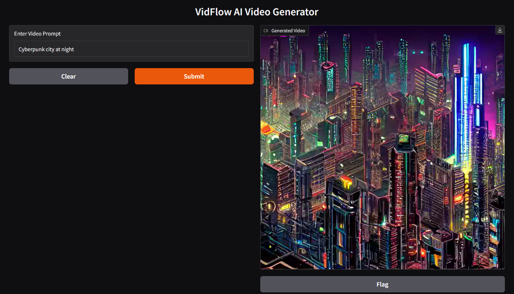
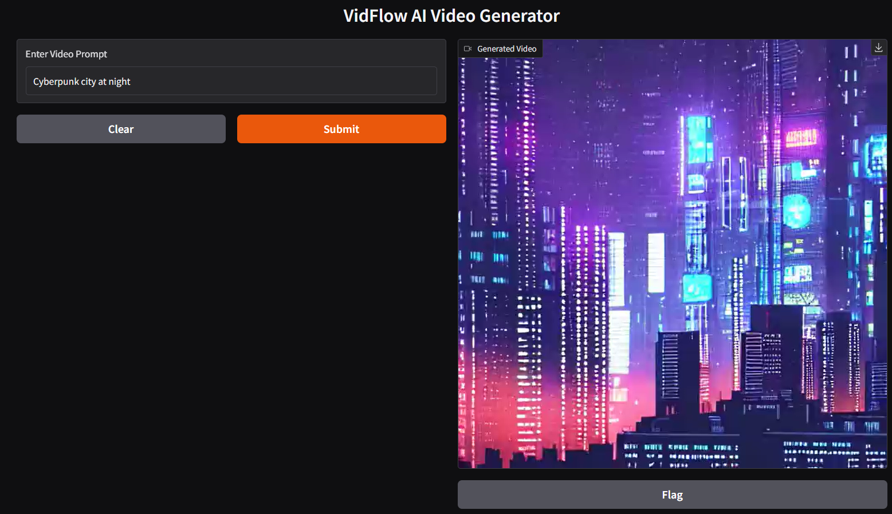

# 🎥 VidFlow – AI Video Generator

VidFlow is an AI-powered application that generates short videos from text prompts using diffusion models.

The system converts a user prompt into multiple scenes, generates images using Stable Diffusion, and combines them into a video.

---

## 🚀 Features

- Generate videos from text prompts
- Diffusion-based image generation
- Automatic scene creation
- Frame-to-video rendering
- Simple web interface using Gradio

---

## 🧠 Architecture

User Prompt  
↓  
Prompt Expansion  
↓  
Image Generation (Stable Diffusion)  
↓  
Frame Creation  
↓  
Video Rendering (OpenCV)  
↓  
Final Video Output

---

## 🛠 Tech Stack

- Python
- PyTorch
- Stable Diffusion
- HuggingFace Diffusers
- OpenCV
- Gradio

---

## 📂 Project Structure
vidflow/
│
├── app.py
├── image_generator.py
├── video_generator.py
├── video_renderer.py
├── prompt_engine.py
│
├── frames/
├── outputs/
└── requirements.txt

---

## ⚙️ Installation

Clone the repository:
git clone https://github.com/Frost270/vidflow-ai-video-generator.git

Navigate to the project folder:
cd vidflow-ai-video-generator

Install dependencies:
pip install -r requirements.txt

---

## ▶️ Running the Application

Run the application:
python app.py

Open in browser:
http://127.0.0.1:7860

Enter a prompt such as:
"Cyberpunk city at night with flying cars"

The AI will generate a short video based on the prompt.

---

## 📌 Example Prompts

- Astronaut walking on Mars
- Dragon flying over mountains
- Cyberpunk city at night
- Futuristic city with neon lights

---

## 📈 Future Improvements

- Real text-to-video models (Stable Video Diffusion)
- Voice narration generation
- Background music generation
- Scene transitions
- Style customization

---

## 📸 Demo

## 👨‍💻 Author

**Ankush Chaudhary**

Python Developer | Data Engineering | AI Enthusiast

GitHub: https://github.com/Frost270

---

## ⭐ Support

If you like this project, consider giving it a star ⭐ on GitHub.